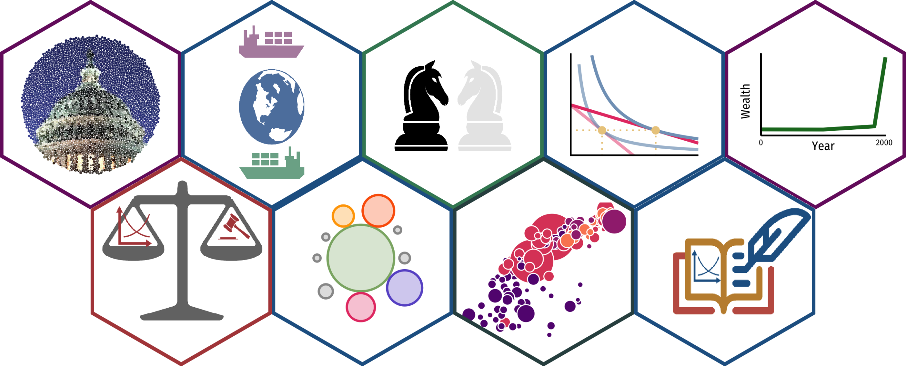

Hex Stickers used for courses websites and course slides

# Stickers

    source("scripts/hexwall.R")

    hexwall(path = "stickers_png/",
            sticker_row_size = 5, # if getting error about "image magick" try changing #
            sticker_width = 500,
            remove_small = TRUE,
            total_stickers = NULL,
            remove_size = TRUE,
            coords = NULL,
            scale_coords = TRUE,
            sort_mode = "random"
    )

All hex images were made using [GuangchuangYu’s `hexSticker`
package](https://github.com/GuangchuangYu/hexSticker).

Hexwall made using [mitchelloharawild’s `hexwall`
package](https://github.com/mitchelloharawild/hexwall).

## Repo Organization

-   `hex_png/` folder stores hex stickers as `.png` files

-   `image_sources/` folder base images used for creation of some
    stickers

-   `scripts/` folder stores scripts to generate each image using
    `hexSticker::sticker()`

-   [Classes](#classes)

    -   [Microeconomics](#microeconomics)
    -   [Economics of the Law](#economics-of-the-law)
    -   [Game Theory](#game-theory)
    -   [Economics of Development](#economics-of-development)
    -   [International Trade](#international-trade)
    -   [Industrial Organization](#industrial-organization)
    -   [Public Economics](#public-economics)
    -   [History of Economic Thought](#history-of-economic-thought)
    -   [Econometrics](#econometrics)

# Classes

## Microeconomics

-   **Course**: ECON 306 at Hood College \[[Fall
    2019](https://microf19.classes.ryansafner.com)\]; \[[Spring
    2020](https://micros20.classes.ryansafner.com)\]; \[[Fall
    2020](https://microf20.classes.ryansafner.com)\]; \[[Spring
    2021](https://micros21.classes.ryansafner.com)\]; \[[Fall
    2021](https://microf21.classes.ryansafner.com)\]; \[[Spring
    2022](https://micros22.classes.ryansafner.com)\]
-   **Details**: A stylized version of an indifference curve graph
    featuring a decrease in the price of good *X*. Bonus points if you
    can identify income and substitution effects! Produced with
    `ggplot2` (see `micro.R` script for source)
-   **Main Color**:
    <code>#236192</code>

## Economics of the Law

-   **Course**: ECON 315 at Hood College \[\[[Spring
    2021](https://lawS21.classes.ryansafner.com)\]\]
-   **Details**: Crudely designed on [Gravit
    Designer](https://www.designer.io/en/), images drawn from [The Noun
    Project](https://thenounproject.com)
    -   [Supply and Demand Graph by Alicia
        Kranjc](https://thenounproject.com/icon/707891/)
    -   [Justice by Jamie
        Hamilton](https://thenounproject.com/term/justice/13484/)
    -   [Justice by Lufti Gani al
        Achmad](https://thenounproject.com/term/justice/2722181/)

## Game Theory

-   **Course**: ECON 316 at Hood College \[[Fall
    2021](https://gameF21.classes.ryansafner.com)\]
-   **Details**: Crudely designed on [Gravit
    Designer](https://www.designer.io/en/), images drawn from [The Noun
    Project](https://thenounproject.com)
    -   [Chess Horse by
        kareemovic2000](https://thenounproject.com/term/chess-horse/1511307/)

## Economics of Development

-   **Course**: ECON 317 at Hood College \[[Fall
    2019](https://devf19.classes.ryansafner.com)\]
-   **Details**: A stylized version of “the great fact” using
    [Maddison’s historical GDP
    data](https://books.google.ca/books?id=YeoEiNLtrLsC&printsec=frontcover&dq=Angus+Maddison,+The+World+Economy,+vol.+2,+Historical+Statistics&hl=en&sa=X&ved=0ahUKEwjmnbvpy4HSAhWhx4MKHaJ0Ah0Q6AEIJTAA#v=onepage&q=Angus%20Maddison%2C%20The%20World%20Economy%2C%20vol.%202%2C%20Historical%20Statistics&f=false).
    Produced with `ggplot2` (see `dev.R` script for source)

## International Trade

-   **Course**: ECON 324 at Hood College \[[Fall
    2020](https://tradef20.classes.ryansafner.com)\]
-   **Details**: Crudely designed on [Gravit
    Designer](https://www.designer.io/en/), images drawn from [The Noun
    Project](https://thenounproject.com)
    -   [Ship by Anne
        Bittencourt](https://thenounproject.com/icon/13420/)
    -   [Globe by i cons](https://thenounproject.com/icon/1939582/)

## Industrial Organization

-   **Course**: ECON 326 at Hood College \[[Spring
    2020](https://ios20.classes.ryansafner.com)\]
-   **Details**: My attempt at an abstract industry depicting firms of
    different sizes/market shares. Produced with `ggplot2` using code
    inspired by [Ed Rubin](https://github.com/edrubin/)’s awesome course
    slides (see `io.R` script for source)

## Public Economics

-   **Course**: ECON 410 at Hood College \[[Spring
    2020](https://publics20.classes.ryansafner.com)\]
-   **Details**: Bubble-packed chart using image, produced with
    `ggplot2` based on [this
    code](https://www.r-bloggers.com/bubble-packed-chart-with-r-using-packcircles-package/)
    (see `oublic.R` script for source)
    -   Image used: [Capitol Dome
        (cropped)](/image_sources/capitaldomecrop.jpg)

## History of Economic Thought

-   **Course**: ECON 452 at Hood College \[[Fall
    2020](https://thoughtf20.classes.ryansafner.com)\]
-   **Details**: Crudely designed on [Gravit
    Designer](https://www.designer.io/en/), images drawn from [The Noun
    Project](https://thenounproject.com)
    -   [Supply and Demand Graph by Alicia
        Kranjc](https://thenounproject.com/icon/707891/)
    -   [Quill and Book by Andreas
        Wilkström](https://thenounproject.com/icon/220016/)

## Econometrics

-   **Course**: ECON 480 at Hood College \[[Fall
    2019](https://metricsf19.classes.ryansafner.com)\]; \[[Fall
    2020](https://metricsf20.classes.ryansafner.com)\]
-   **Details**: Stylized version of [Hans Rosling’s health + wealth
    plot](https://github.com/jennybc/gapminder). Produced in `ggplot2`
    (see `metrics.R` script for source)

# License

Everything here is licensed under a
<a rel="license" href="http://creativecommons.org/licenses/by-sa/4.0/">Creative
Commons Attribution-ShareAlike 4.0 International License</a>.

