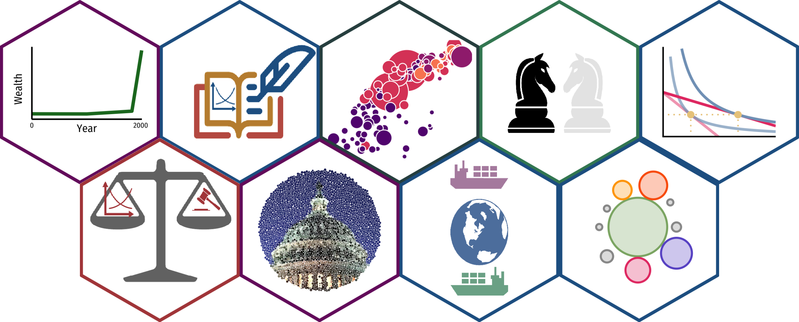

hexstickers
===========

Hex Stickers for courses and packages

Using [hexwall](https://github.com/mitchelloharawild/hexwall).

    source("scripts/hexwall.R")

    ## Linking to ImageMagick 6.9.9.39
    ## Enabled features: cairo, fontconfig, freetype, lcms, pango, rsvg, webp
    ## Disabled features: fftw, ghostscript, x11

    hexwall(path = "stickers_png/",
            sticker_row_size = 3,
            sticker_width = 500,
            remove_small = TRUE,
            total_stickers = NULL,
            remove_size = TRUE,
            coords = NULL,
            scale_coords = TRUE,
            sort_mode = "random"
    )

